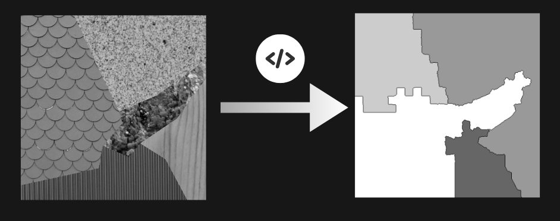

# Texture-Segmentation-Algorithm

## Description
This project includes algorithms for image segmentation using a combination of image processing approaches and machine learning techniques. Key methods involve KMeans clustering and the watershed algorithm.
  
## Requirements 
- Python 3
- OpenCV
- scikit-image
- scikit-learn
- NumPy
- Matplotlib

## Segmentation Algorithm
The segmentation algorithm follows these steps:

1. **Preprocessing**: Reads the image and applies histogram equalization to improve contrast. Gaussian blurring is applied to smooth the image and reduce noise and details. The image is resized to match the specified region size.

2. **Texture Feature Calculation**: For each image fragment, texture features are calculated using the Gray Level Co-occurrence Matrix (GLCM). Characteristics such as dissimilarity and correlation are analyzed.
 
3. **Filtering and Clustering**: Fragments are filtered based on predefined thresholds for dissimilarity and correlation. The optimal number of clusters is determined, and the KMeans algorithm is applied to cluster the filtered fragments.

4. **Watershed Segmentation**: Based on a mask for the processed image, the watershed algorithm is applied to delineate boundaries between clusters. Boundaries of the segments are displayed and saved.

5. **Additional SLIC Segmentation**: Simple Linear Iterative Clustering (SLIC) is used for preprocessing the image before the main segmentation process, improving the results.

6. **Visualization**: Displays clusters, segmentation results, and texture boundaries.

## Contact
For additional questions, write to me at nikitos2159@gmail.com